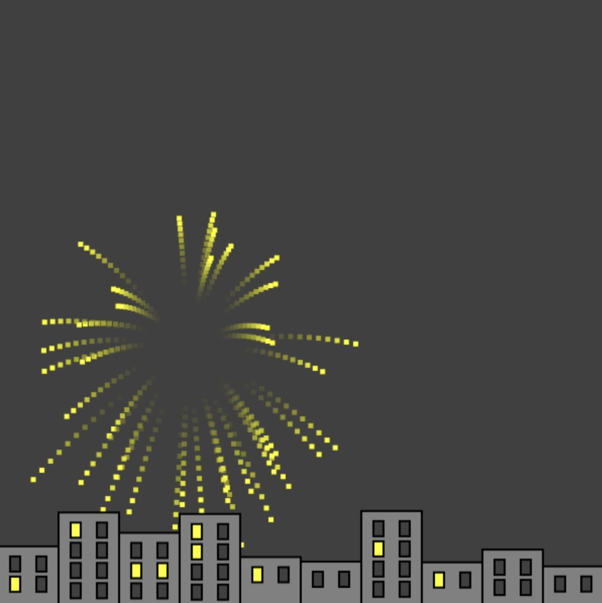

# yali6030_9103_tut4
### Part 1: Imaging Technique Inspiration

* Digital Photography 
* Low-speed Cinematography  
  
These photographs primarily utilize digital and slow-motion imaging techniques. Digital photography, with its precision, adeptly captures the vibrant hues and intricate details within an image. Slow motion photography, on the other hand, is capable of capturing images at ultra-high frame rates, which can give powerful visual effects and many details that are difficult for the human eye to perceive. Both technologies not only encapsulate life's dynamic instants but also convey continuity reminiscent of a firework's trajectory. Therefore, I think these two imaging techniques can be combined with "Ntange II (Grass) Emily_Kame_Kngwarreye”. Through them, it is possible to make this work seem like fireworks, blooming in front of the audience from beginning to end.

### Part 2: Coding Technique Exploration
In this fireworks simulation, **the Object-Oriented Programming (OOP)** technique is utilized. **The Particle class** encapsulates properties such as position, velocity, colour, size, lifetime and trajectory. **The Firework class**, an extension of the Particle class, primarily simulates the movement of fireworks before they explode. Each Firework object possesses a countdown property. When the countdown concludes, it explodes, generating multiple Particle objects in a radial pattern to simulate the explosion effect of fireworks.Therefore a different effect can be achieved by slowing down the speed.

In addition, the colours and movement directions of the fireworks are dynamically determined through **random operations on arrays**, ensuring a unique explosion effect each time. The lerpColor function is used to simulate the colour gradient effect of the particle trajectory. Also through the mousePressed() function, the user can click anywhere on the screen to launch the fireworks, which enhancing the interactive nature of this simulation.

https://happycoding.io/tutorials/p5js/creating-classes/fireworks
